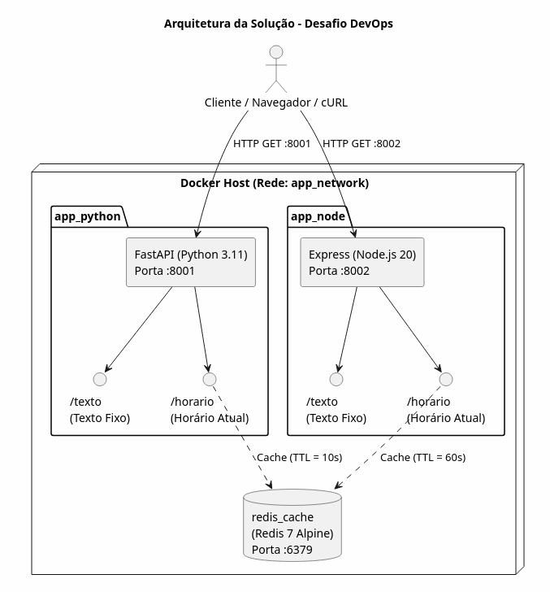
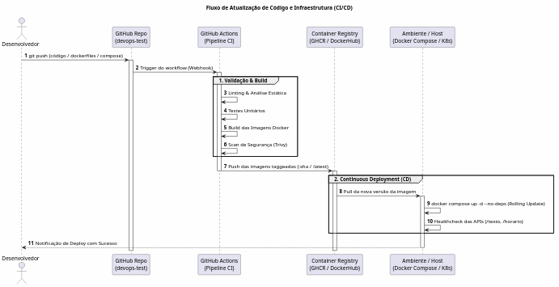

# 🚀 Desafio DevOps 2026

Solução contendo duas APIs em linguagens diferentes (Python e Node.js), com camada de cache no Redis e orquestradas via Docker Compose para execução simples e rápida.

---

## 📌 Visão Geral da Arquitetura



O projeto é composto por 3 serviços rodando em contêineres Docker:

* **App Python (FastAPI):** Rota de texto fixo e rota de horário com cache Redis de **10 segundos**.
* **App Node.js (Express):** Rota de texto fixo e rota de horário com cache Redis de **60 segundos (1 minuto)**.
* **Cache (Redis):** Armazena as respostas temporárias de horário para reduzir reprocessamento.

---

## 🚀 Fluxo de Atualização (CI/CD)



---

## 🛠️ Tecnologias Utilizadas

* **Linguagens & Frameworks:** Python 3.11 (FastAPI) e Node.js 20 (Express).
* **Camada de Cache:** Redis 7 (Alpine).
* **Containerização:** Docker e Docker Compose.

---

## 💡 Identificação e Sugestões de Melhorias

### 1. Ponto Único de Entrada (Nginx)
* Adicionar um proxy reverso com **Nginx** na frente das duas aplicações.
* **Motivo:** Permite acessar tudo por uma única porta (80), organizando as URLs em `/python` e `/node` em vez de expor as portas 8001 e 8002 diretamente.

### 2. Rota de Verificação de Saúde (Healthcheck)
* Criar uma rota simples `/health` em cada aplicação.
* **Motivo:** Permite que o Docker verifique automaticamente se a API e o Redis continuam respondendo, reiniciando o contêiner se algo travar.

### 3. Segurança nos Contêineres
* Adicionar uma senha simples no Redis via variável de ambiente.
* Configurar os Dockerfiles para rodar com usuário sem privilégios de administrador (*non-root*).

### 4. Automação Básica (CI)
* Criar um pipeline simples no GitHub Actions para testar se o `docker compose build` passa com sucesso a cada novo envio de código.

## ⚙️ Pré-requisitos

* Docker e Docker Compose instalados na máquina.

---

## 🏃 Como Rodar o Projeto

1. Copie o arquivo de exemplo para criar suas variáveis de ambiente:
```bash
cp .env.example .env